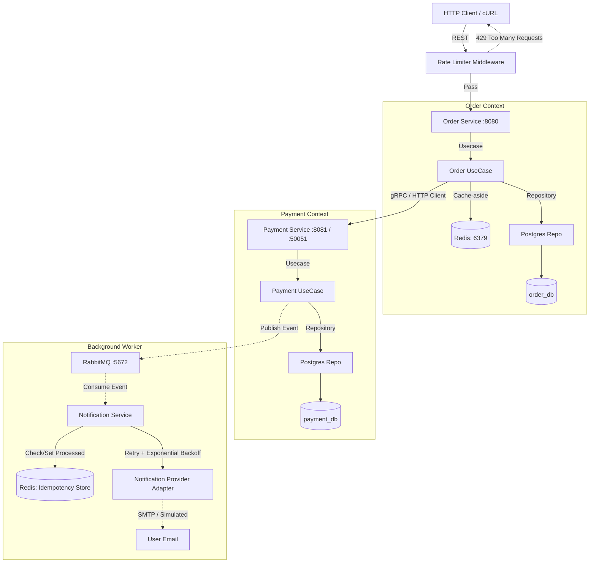

# Order & Payment Platform (Microservices)

This project implements a resilient two-service platform (Order & Payment) using **Go**, **Clean Architecture**, and **PostgreSQL**.

## 🏗 Architecture Overview

Each service is designed following **Clean Architecture** principles to ensure separation of concerns and testability.

### Service Boundaries & Flow


## 🛠 Features Implemented
- **Clean Architecture:** Strict separation into Domain, Use Case, Repository, and Transport layers.
- **Service Decomposition:** Two bounded contexts with **Database-per-Service** (no shared storage).
- **Resilient Communication:** Order Service uses a custom HTTP client with a **2-second timeout**.
- **Idempotency (Bonus Assignment 2):** Prevents duplicate orders/payments using the `Idempotency-Key` header.
- **Rate Limiter (Bonus Assignment 4):** A Redis-based middleware that strictly limits API clients to 10 requests per minute. Returns `429 Too Many Requests`.
- **Search Filter:** Search orders by amount range with strict validation.
- **Fault Tolerance:** Returns 503 Service Unavailable if the payment service is down.

## 🚀 How to Run (Docker Compose)

The entire environment including PostgreSQL, RabbitMQ, Redis, and the three microservices runs automatically via `docker-compose`.

```bash
# Start all services
docker-compose up -build
```

Wait until RabbitMQ, PostgreSQL, Redis, and all services are running.

## 🧪 API Examples

**Create Order (POST):**
```bash
curl -X POST http://localhost:8080/orders \
-H "Content-Type: application/json" \
-H "Idempotency-Key: unique-123" \
-d '{"customer_id": "user_01", "item_name": "Laptop", "amount": 50000}'
```

Watch the logs of `notification-service` to see the simulated email and retry logic.

## 🛡 Business Rules Logic
1. **Financial Accuracy:** All monetary values use `int64` (cents).
2. **Payment Limits:** Amounts > 100,000 cents ($1,000) are automatically **Declined**.
3. **Immutability:** "Paid" orders cannot be cancelled.
4. **Resilience:** If Payment Service is down, orders are marked as **Failed** and a 503 error is returned.

## 📡 Event-Driven Architecture (Assignment 3)

### Idempotency Strategy
The **Notification Service** acts as an idempotent consumer. It utilizes Redis to store a record (`processed_msg:{message_id}`) when a notification successfully processes. Before sending an email, it checks Redis; if the key exists, it skips processing and acknowledges the duplicate.

### ACK Logic Implementation
We disabled `auto-ack`. Manual acknowledgment is performed *only after* the business logic has successfully executed. If processing fails permanently, the message is negatively acknowledged without requeueing, pushing it directly to the DLQ.

### Bonus: Dead Letter Queue (DLQ)
Configured to capture permanently failed messages. If an order is made with a specific target amount (`amount: 99999`), the Notification Service deliberately triggers a permanent error, moving the message to `payment.dlq`.

## ⚡ Performance & External Integrations (Assignment 4)

### Caching Strategy & Invalidation (Order Service)
The Order Service utilizes the **Cache-aside** pattern via Redis. 
- **Read Path:** When a user fetches an order by ID (`GET /orders/:id`), the service first checks Redis. If there's a cache miss, it queries PostgreSQL and immediately saves the result into Redis with a **5-minute TTL**.
- **Atomic Invalidation:** When an order is created (which involves an immediate status update from `Pending` to `Paid`/`Failed`) or cancelled, the `OrderUseCase` explicitly issues a `DEL` command to Redis (`uc.cache.Invalidate(order.ID)`). This absolutely guarantees that users will never fetch stale "Pending" statuses after a payment is authorized.

### Reliable Background Worker & Retry Logic (Notification Service)
The Notification Service was transformed into a robust Background Worker utilizing the **Adapter Pattern**. 
- The core logic is completely isolated from the email vendor (Mailjet/SMTP or Simulated) behind an interface. 
- **Retry Logic:** If the external provider throws an error (e.g., timeout), the worker executes an **Exponential Backoff** retry strategy. It pauses for `2s`, then `4s`, and finally `8s` before failing entirely. This heavily protects our system from transient network failures.
