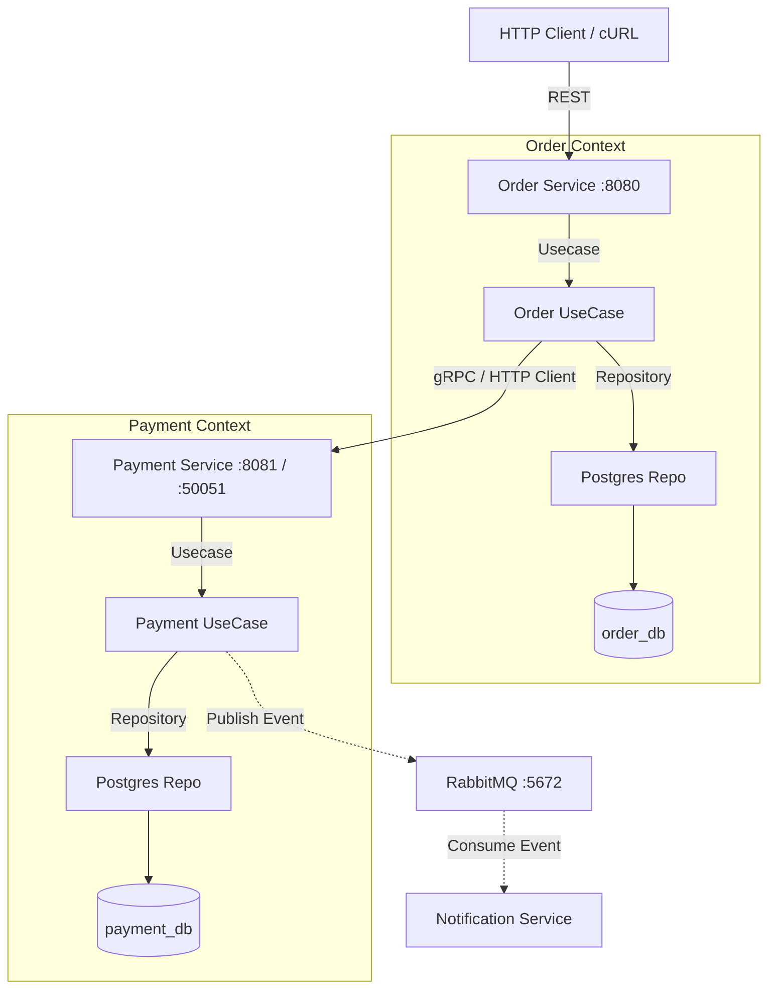

# Order & Payment Platform (Microservices)

This project implements a resilient two-service platform (Order & Payment) using **Go**, **Clean Architecture**, and **PostgreSQL**.

## 🏗 Architecture Overview

Each service is designed following **Clean Architecture** principles to ensure separation of concerns and testability.

### Service Boundaries & Flow


## 🛠 Features Implemented
- **Clean Architecture:** Strict separation into Domain, Use Case, Repository, and Transport layers.
- **Service Decomposition:** Two bounded contexts with **Database-per-Service** (no shared storage).
- **Resilient Communication:** Order Service uses a custom HTTP client with a **2-second timeout**.
- **Idempotency (Bonus +10%):** Prevents duplicate orders/payments using the `Idempotency-Key` header.
- **Search Filter:** Search orders by amount range with strict validation.
- **Fault Tolerance:** Returns 503 Service Unavailable if the payment service is down.

## 🚀 How to Run (Docker Compose)

The entire environment including PostgreSQL, RabbitMQ, and the three microservices runs automatically via `docker-compose`.

```bash
# Start all services
docker-compose up -build
```

Wait until RabbitMQ, PostgreSQL, and all services are running.

## 🧪 API Examples

**Create Order (POST):**
```bash
curl -X POST http://localhost:8080/orders \
-H "Content-Type: application/json" \
-H "Idempotency-Key: unique-123" \
-d '{"customer_id": "user_01", "item_name": "Laptop", "amount": 50000}'
```

Watch the logs of `notification-service` to see the simulated email:
```text
[Notification] Sent email to user_... for Order #... Amount: $500
```

## 🛡 Business Rules Logic
1. **Financial Accuracy:** All monetary values use `int64` (cents).
2. **Payment Limits:** Amounts > 100,000 cents ($1,000) are automatically **Declined**.
3. **Immutability:** "Paid" orders cannot be cancelled.
4. **Resilience:** If Payment Service is down, orders are marked as **Failed** and a 503 error is returned.

## 📡 Event-Driven Architecture (Assignment 3)

### Idempotency Strategy
The **Notification Service** acts as an idempotent consumer. It utilizes a synchronized, in-memory map (`sync.Map`) to track processed message IDs. When a message is consumed, the service checks if its `MessageId` is already present. If it is, the message is ignored and safely acknowledged. This ensures that in scenarios of at-least-once delivery (where duplicate messages might be sent), the email logging only occurs once per event.

### ACK Logic Implementation
We disabled `auto-ack` (`autoAck: false` in `ch.Consume`) to guarantee message reliability.
- **Success (`d.Ack(false)`):** Manual acknowledgment is performed *only after* the business logic (printing the email log) has been successfully executed.
- **Failure (`d.Nack(false, false)`):** If processing fails permanently (e.g., parsing error or simulated failure), the message is negatively acknowledged without requeueing, pushing it directly to the Dead Letter Queue.

### Bonus: Dead Letter Queue (DLQ)
A Dead Letter Exchange (`payment.dlx`) and Queue (`payment.dlq`) have been configured to capture permanently failed messages. 
- **Demonstration:** If an order is made with a specific target amount (e.g., exactly `amount: 99999`), the Notification Service detects this and deliberately triggers a permanent error, executing a `Nack` with `requeue=false`. 
- **Observation:** This message is removed from the `payment.completed` queue and instantly transferred to the `payment.dlq` queue, demonstrating effective isolation of poison messages without crashing the consumer.
